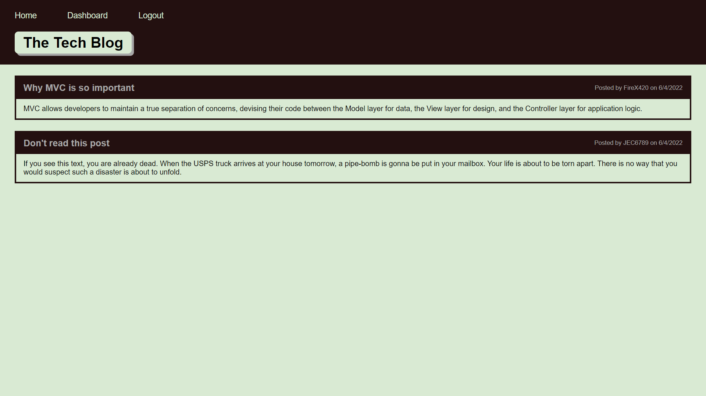

# Tech Blog

## Purpose
This is a blog website where users are intended to post about and discuss technology-related content. Nothing stopping you from posting about anything else though. Creating an account is required for you to make posts or comment on anything.

## Website
need to push to heroku first

## Known issues
The content of posts (and presumably comments) is limited to 255 characters. This appears to be a limitation of SQL, and it's not something I plan on fixing at this time.

## Contributors

Made with ❤️ by JEC6789